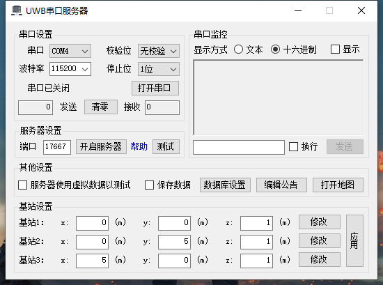
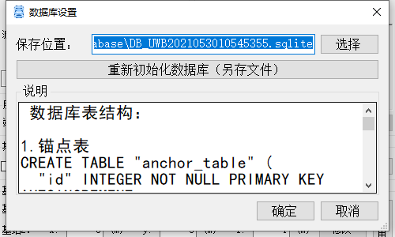
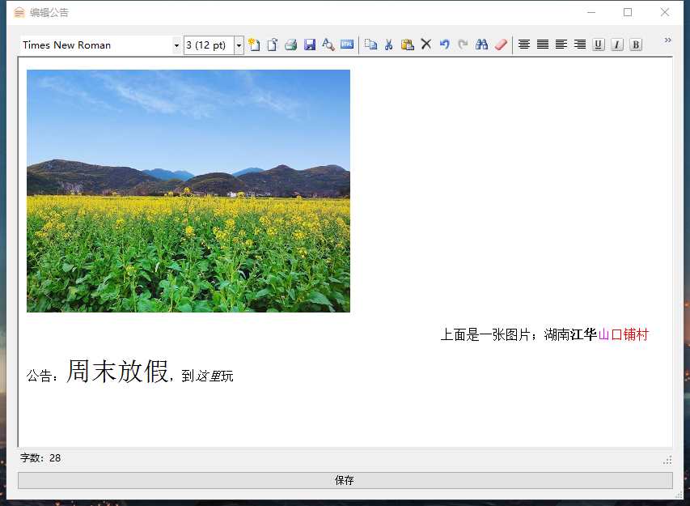
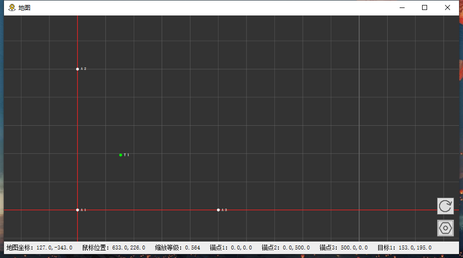
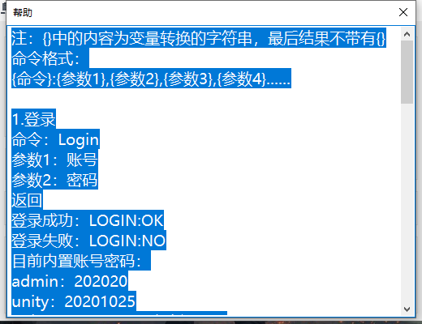

# UWB串口服务器

#### 介绍
使用DWM1000进行室内定位，通过串口连接UWB基站获得定位信息，再通过TCP把位置信息转发到其他应用程序上。

#### 主界面：

如果需要配合单片机，用串口连接到单片机，点击“开启服务器”即可。

如果需要测试，勾选“服务器使用虚拟数据以测试”，点击“开启服务器”。

测试时，基站位置不会对目标位置产生影响。

#### 数据库设置界面：

勾选“保存数据”复选框后，可将锚点、目标点和原始数据存储在数据库里。

#### 编辑公告：

能编辑类似Word 的内容，以Base64保存在本地文件内，可由客户端获取。

#### 地图

在地图上可以看到三个锚点和目标点的位置。

#### 帮助

部分功能有帮助按钮，可以看到一些帮助信息。

#### 软件架构
软件架构说明
使用了SuperSocket、WinHtmlEditor和SQLite库

#### 安装教程

1.  直接在编辑器里打开使用

#### 使用说明

1.  Visual Studio 2019

#### 参与贡献

1.  Minuy

#### 特技

1.  博客 [https://www.cnblogs.com/minuy](https://www.cnblogs.com/minuy)
